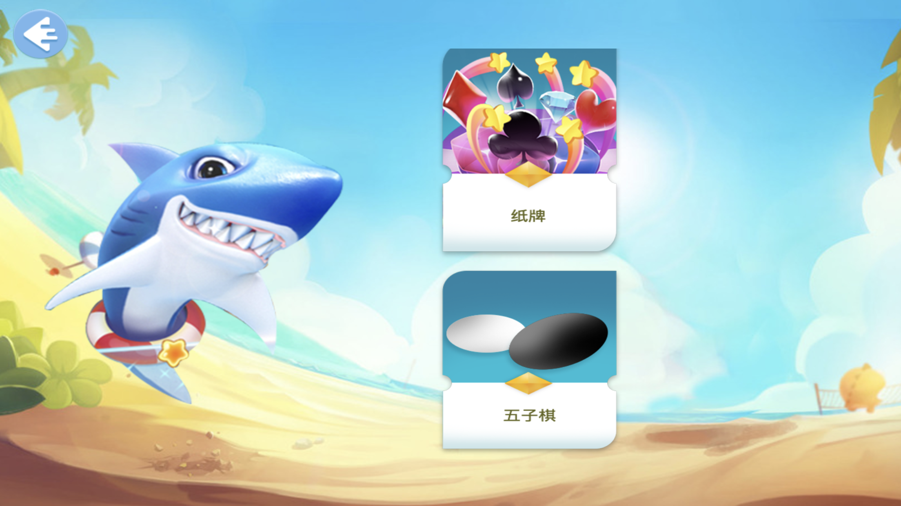
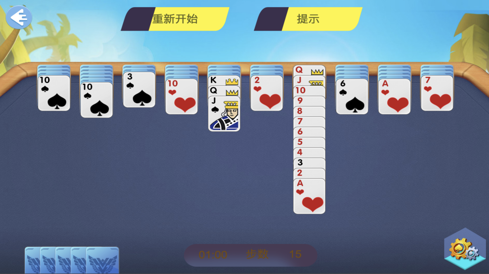
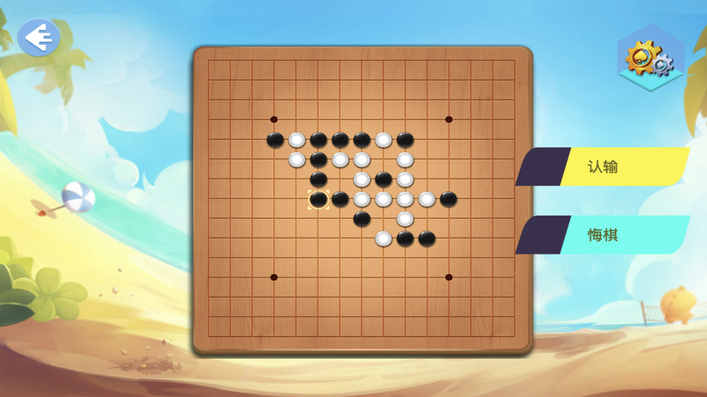

# 浪游游戏

浪游蜘蛛纸牌
        游戏开始时，发有十叠牌，每叠中只有一张正面朝上。其余的牌放在窗口右下角的五叠牌叠中；新一轮发牌时用这些牌。
        移牌的方法是将牌从一个牌叠拖到另一个牌叠。移牌的规则如下：
        可以将牌叠最底下的牌移到空牌叠。
        可以将牌从牌叠最底下移到牌值仅次于它的牌上，不论牌套或颜色如何。
        可以像对待一张牌一样移动一组同样牌套、依序排好的牌。
        准备新一轮发牌时，请单击“发牌”，或者单击窗口右下角的牌叠。
        在新一轮发牌之前，每一叠中都必须有牌。

浪游五子棋\n
—随时随地，无法阻挡再来一局的冲动。
—四种难度，高强度AI棋路变幻莫测。
—黑白对弈，是纵观全局还是任其摆布？
—是时候展现真正的智慧了。

***游戏简约精致，功能全面，体验全自由化的独特风格。
***无论你是初出茅庐的萌新，还是久经棋场的棋圣，在这里都会让你得到满足。
***多种级别AI，路数变换莫测、随机应变，到底如何取胜？
***双人对弈，最方便的五子棋平台，让你和朋友一较高下。

五子棋是起源于中国古代的传统黑白棋种之一，不仅能增强逻辑思维能力，提高智力，而且富含哲理，有助于修身养性。饱含现代休闲的明显特征“短、平、快”，又有古典哲学的高深学问“阴阳易理”。且棋文化渊源流长，完美的结合了东方的神秘和西方的直观。五子棋是中西文化的交流点，亦是古今哲理的结晶。

史诗级AI，棋逢对手勇者胜，你何时来挑战？

联系我们:
- cj@applemoon.cn
